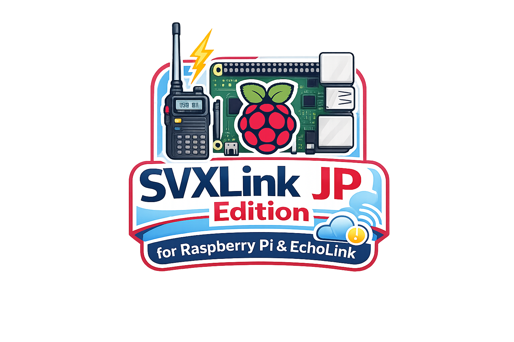

SVXLink JP Edition

Created by JQ1YOF

Official Japanese Edition

Version 1.0

  

# SVXLinkJP

## SVXLink JP Edition for Raspberry Pi & EchoLink

日本語で SVXLink を簡単に設定・管理するための管理システムです。

### 主な機能

- 日本語メニュー
- SVXLink設定
- EchoLink設定
- ネットワーク設定（DHCP/固定IP）
- ネットワークバックアップ・復元
- システムバックアップ
- システム情報表示
